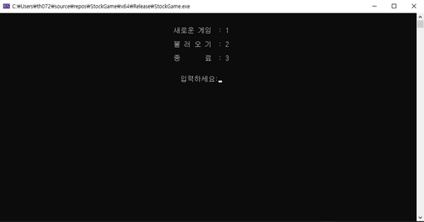

# 주식 시뮬레이션 게임

## 개요
이 프로그램은 주식 시뮬레이션 게임입니다. 플레이어는 가상의 돈을 가지고 여러 회사의 주식을 사고팔며 부자가 되는 것이 목표입니다. 게임 내에서 시간이 흐르면서 주가가 변동하고, 기업 뉴스에 따라 주가에 영향을 미칩니다.

## 조작법
- B: 주식 구매
- S: 주식 판매
- E: 게임 저장
- I: 보유 주식 정보 확인
- 8/2: 회사 선택
- Esc: 메뉴 열기
  - 1: 재무 상태 확인
  - 2: 대출
  - 3: 대출 상환
  - 4: 계속 진행
  - 5: 게임 종료

## 게임 화면
1. 상단: 현재 시간, 뉴스 헤드라인, 뉴스 기사
2. 중앙: 주가 차트
3. 하단: 회사 목록 및 주가 정보

## 주요 기능
- 주식 거래: 플레이어는 돈을 가지고 회사의 주식을 사고팔 수 있습니다.
- 시간 경과: 일정 시간이 지나면 주가가 변동합니다.
- 뉴스 이벤트: 기업 관련 좋은 뉴스와 나쁜 뉴스가 발생하며, 이에 따라 주가가 영향을 받습니다.
- 대출 기능: 부족한 자금을 대출받을 수 있습니다.
- 세금 납부: 일정 기간마다 소득에 대한 세금을 납부해야 합니다.
- 게임 저장 및 로드: 진행 상황을 저장하고 불러올 수 있습니다.